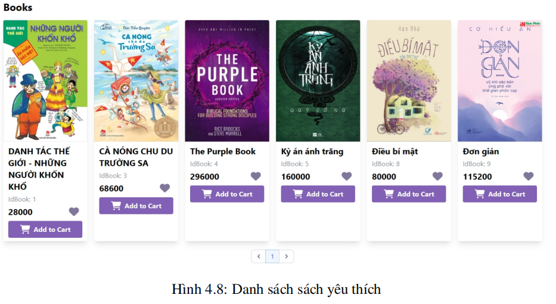
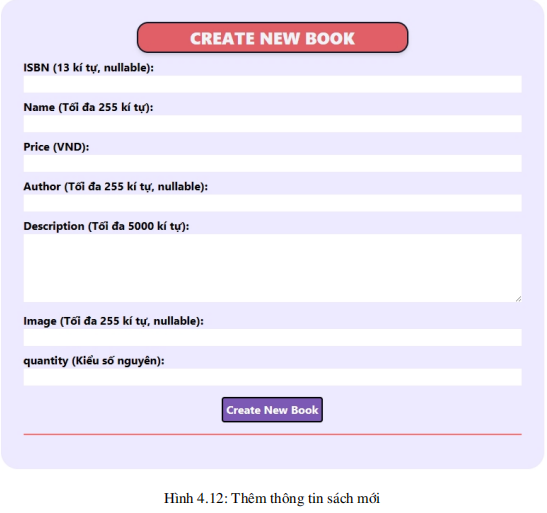

# <p align = 'center'>**BookHaven WebSite - Paradise for Book Lovers - BHW**</p>
<p align ='center'> Developed by Group 18 - LTW - HK232</p> 

## Table of content
- [Introduction](#introduction)
- [Technologies Used](#🛠️-technologies-used)
- [Source code](#🚀-Source-code)
- [Security & SEO](#📌-Security-&-SEO)
- [Software Design - Thiết kế phần mềm](#📌-Software-Design---Thiết-kế-phần-mềm)
- [Source Code Structure](#📌-Source-Code-Structure)
- [Software Features - Các tính năng của phần mềm](#📌-Software-Features---Các-tính-năng-của-phần-mềm)
- [Implementation](#📌-Implementation)
- [Feature Overview](#📌-Feature-Overview)
- [Installation Guide](#📌-Installation-Guide)
- [Contributors](#🏆-Contributors)

## **📌Introduction**
🎓 BookHaven is an e-commerce platform dedicated to books, providing a modern and convenient shopping experience for book lovers. With the rapid growth of the Internet and changing consumer behavior, BookHaven was created to meet the demand for easy, fast, and seamless book discovery and purchasing.

🎓 Inspired by Fahasa, BookHaven offers a familiar and intuitive interface, allowing users to browse, search, and purchase books with ease. Customers can also create personal accounts to save their favorite books, track orders, and receive exclusive deals.

<p align="center"></p>

🎓 Beyond being a shopping platform, BookHaven helps businesses promote their products, connect with partners, and provide information about bookstores, promotions, and customer support services. With a modern, intuitive design and optimized features, BookHaven promises to be "The Paradise for Book Lovers" – delivering the best reading and shopping experience for book enthusiasts of all ages.

<p align="center"></p>


## **🛠️Technologies Used**

BookHaven is built using a modern and efficient technology stack, ensuring a seamless user experience, maintainability, and scalability. Below are the core technologies and tools powering the platform:

- Frontend & UI:
  - `Tailwind CSS` – A utility-first CSS framework that enables rapid UI development with reusable classes, providing flexibility without writing extensive custom CSS.

- Backend Development:
  - `PHP (Core PHP)` – A widely-used scripting language that allows complete control over the application without relying on additional frameworks. This ensures a lightweight, customizable, and performance-driven backend.

  - `MySQL with MySQLi` – A robust relational database system that integrates efficiently with PHP, offering secure and optimized data management through prepared statements.

- API & Testing:
  - `Postman` – A powerful API testing and debugging tool, streamlining API development and ensuring reliability through structured request-response testing.

- Version Control & Collaboration:
  - `GitHub` – A cloud-based version control system facilitating seamless code management, collaboration, and deployment with features like branching, pull requests, and issue tracking.

- JavaScript Enhancements:
  - `jQuery` – A lightweight JavaScript library that simplifies DOM manipulation, AJAX requests, and event handling, enhancing user interactivity and responsiveness.

<p align="center"></p>

🏆 **Strengths & Trade-offs**
| Technology | Strengths | Trade-offs |
|-------|-------|-------|
| Tailwind CSS | Rapid development, highly customizable UI, no need for additional CSS files | Can lead to cluttered HTML with excessive utility classes |
| PHP | Full control over code, widely supported, strong community | Can become unstructured if not well-organized |
| MySQLi | Secure data handling, prepared statements prevent SQL injection | More code required for complex operations compared to ORM |
| Postman | Efficient API testing, intuitive UI	 | Limited for deep application-level integration testing |
| GitHub | Strong collaboration tools, version control, team coordination | Steeper learning curve for Git workflows |
| jQuery | Simplifies DOM interactions and AJAX requests | Can lead to performance overhead if used excessively |

By leveraging these technologies, BookHaven offers a robust, user-friendly, and scalable platform that ensures a smooth book shopping experience while maintaining security, efficiency, and ease of development.

## 🚀 **Source code:**
The source code of the software can be accessed via the following link:

🔗 [BookHaven WebSite SourceCode](https://github.com/DanteBartel/HK232_Web_Nh-m_18_BTL)

## 📌**Security & SEO** 
🚀 **Security**:

Security is a crucial factor in website development, ensuring user data protection and maintaining trust. An unsecured website may be vulnerable to attacks, data leaks, and a poor user experience.

To enhance security, **BookHaven** implements basic measures such as:
- **Using HTTPS** to ensure a secure connection.
- **Protecting user data**, especially login credentials.
- **Regularly checking and fixing security vulnerabilities** to minimize potential risks.

While it's impossible to eliminate all threats, these measures help make the website safer and better protect users.

🚀 **SEO**:

Search Engine Optimization (SEO) helps a website appear on search engines like Google, increasing its reach to potential customers.

Some ways BookHaven improves SEO:
- **Optimizing content** with clear titles and descriptions.
- **Enhancing page loading speed** for a better user experience.
- **Ensuring mobile-friendly design**, making it accessible across multiple devices.

With these simple adjustments, **BookHaven** can reach a wider audience and make it easier for customers to find products on the website.


## 📌**Software Design - Thiết kế phần mềm** 

### Database: 

<p align="center"></p>

🚀 The database implementation includes the following data types:

- `Varchar`: Used instead of `char` because `varchar` has a variable length depending on usage, while `char` has a fixed length. This helps save storage when dealing with attributes of uncertain length. Additionally, using `varchar` instead of `int` for some fields ensures that leading zeros in input values are preserved.

- `Int`: Used for certain ID fields to reduce storage requirements. However, when using `int` for ID or code fields, leading zeros will be automatically removed.

- `Double`: Chosen for attributes like price, which may have large values. `Double` can store up to 8 bytes, significantly more than the 4 bytes of `float`, ensuring greater precision in calculations.

- `Tinyint`: Used exclusively for the `type` attribute. This is suitable for boolean-like values and helps optimize storage. In MySQL, `BOOLEAN` is essentially `TINYINT(1)`. In the `type` field, `0` represents an admin account, while `1` represents a user account.

🚀 The database consists of four tables:

- `Account`: Stores user account information, including `username`, `password`, `type` (0 for admin, 1 for user), and `email`.

- Book: Stores book details. Three fields—`isbn`, `author`, and `image`—are nullable. The `username` field must be unique.

- `Favorite book`: Stores the "favorite" relationship between users and books, containing two foreign keys referencing the `Account` and `Book` tables.

- `Ad_images`: Stores additional images for a book.

🚀 Relationships:

- `Account` has a one-to-many relationship with `Favorite book`, with cascade delete enabled.

- `Book` has a one-to-many relationship with `Favorite book`, also with cascade delete enabled.

- `Book` has a one-to-many relationship with `Ad_images`, where deleting a book cascades to its associated images.

### Application Model:

<p align="center"></p>

Our team chose the `MVC (Model-View-Controller)` pattern for this project. MVC is a software design pattern that separates an application into three interconnected components, improving organization, maintainability, scalability, and code reusability.

- `Model`: Handles data and business logic. It represents application data and the operations that can be performed on it. Separating the model from other components allows us to modify or expand data processing logic without affecting the user interface.

- `View`: The user interface that displays data from the model and provides an interactive experience. The separation between the view and other components enables UI modifications without impacting data processing.

- `Controller`: Manages application flow and user input. It receives user requests, interacts with the model to fetch data, and updates the view accordingly. This separation ensures a clear control flow and simplifies testing.

## 📌**Source Code Structure** 

The source code is stored and accessed by team members through the GitHub platform. The source code structure is organized as follows:

<p align="center">

</p>

It is divided into three main parts:

- MVC Application Model
- Data
- API and Utils

The directories containing the MVC model manage the application's codebase structure and are organized into three folders:

- `/models`: Handles data and business logic
- `/views`: Manages the user interface display
- `/controllers`: Controls and directs the website's workflow

<p align="center">

</p>

The **data-related directories** include the database and resources used during website development, divided into:

- `/dbScript`: Database scripts
- `/assets`: Website resources

<p align="center">

</p>

The API and Utils directories contain API calls for website communication and supporting logic, divided into:
- `/api`: API management
- `/utils`: Supporting logic

<p align="center">

</p>

## 📌**Software Features - Các tính năng của phần mềm**

The website features are categorized based on user access levels, with the hierarchy: Guest -> User -> Admin. This classification helps the team identify the necessary functionalities for each user group, ensuring the implementation meets the specific needs of different access levels.

**1. Guest Access:**

The `Guest` level is the lowest access tier, applicable to first-time visitors or users who do not wish to create an account. Regardless of the access level, all users can view the `Home page`, which provides an overview of the website.

Additionally, users at this level can register and log in to store their favorite books.

**Features available for Guests**:

- View the Home page, recommended books, and promotions
- Browse the complete book collection on the website
- Register and log in

**2. User Access:**

At the `User` level, users have created an account and logged in to access their `personalized experience`. This level allows users to `manage their personal book collection`, saving books of interest. They can also update their account information.

**Features available for Users:**

- View the Home page, recommended books, and promotions
- Browse the complete book collection
- Log out of their account
- Edit account information
- Manage their favorite book collection

**3. Admin Access:**

This is the `highest access level`, designated for `business administrators` to manage the website efficiently. Admins can `add, delete, and modify information` about all books displayed on the site. Similarly, they have the ability to `delete user accounts` if necessary.

**Features available for Admins:**

- View, add, edit, and delete books
- View and delete user accounts
- View, add, edit, and delete additional book images


## 📌**Implementation**

### **Application Programming Interface - API**

The application consists of web servers that allow HTTP requests to execute CRUD operations related to Account, Book (a single book), Books (multiple books), Additional Images (book covers), Favorite Book, and Login.

**1. Account:**
  
The Account API allows CRUD operations on user accounts within the web service through four HTTP methods: GET, POST, PUT, and DELETE.
**<p align='center'> Endpoint: "/api/accounts.php" </p>**

- `GET`: This method is used to `READ` user accounts stored in the web service:
  - If the GET request includes the `"id"` parameter, it will query a specific account by ID:
    - Returns `status code 200` with account information in the JSON response if successful.
    - Returns `status code 404` if the account with the given ID is not found.
  - If no parameters are provided, it returns `all accounts` with "User" level stored in the web service.

- `POST`: This method is used to CREATE an account in the web service database:
  - The HTTP request body should be in JSON format and contain `"username"`, `"password"`, `"type"`, and `"email"`.
    - Returns `status code 201` if the account is successfully created in the database.
    - Returns `status code 422` if the provided information cannot be processed by the web service.
  - If no account information is provided in the request body, it returns `status code 400` (Bad Request).

- `PUT`: This method is used to UPDATE an existing account in the web service database:
  - The HTTP request body should be in JSON format and contain the `"id"` of the account to be modified, along with one of the three fields: `"username"`, `"password"`, or `"email"`.
    - If multiple fields are sent, the account will only be updated based on the first field appearing in this order.
    - Returns `status code 200` if the update is successful.
    - Returns an error status code if the update fails due to incorrect data (e.g., non-existent `"id"`).
  - If no account information is provided in the request body, it returns `status code 400` (Bad Request).

- `DELETE`: This method is used to DELETE an account from the web service database:
  - The HTTP request body should be in JSON format and contain the `"id"` of the account to be deleted.
    - Returns `status code 204` if the deletion is successful.
    - Returns `status code 404` if the account with the given `"id"` does not exist.
  - If no account information is provided in the request body, it returns `status code 400` (Bad Request).

**2. Book:**

The Book API allows CRUD operations on an individual book using four HTTP methods: GET, POST, PUT, and DELETE.

**<p align='center'> Endpoint: "/api/book.php" </p>**

Any other HTTP methods sent to this endpoint will return status code 405 (Method Not Allowed).

- `GET`: This method is used to READ a book stored in the web service. If the GET request includes the `"id"` parameter, it will query a specific book by ID:
  - Returns `status code 200` with book details in the JSON response if successful.
  - Returns `status code 500` if the book with the given ID is not found.

- `POST`: This method is used to CREATE a book entry in the web service database:
  - The HTTP request body should be in JSON format and contain `"isbn"`, `"name"`, `"price"`, `"author"`, `"description"`, `"image"`, and `"quantity"`.
    - Returns status code 201 if the book is successfully created in the database.
    - Returns status code 422 if the provided information cannot be processed by the web service.
  - If no book information is provided in the request body, it returns `status code 400` (Bad Request).
 
- `PUT`: This method is used to UPDATE an existing book entry in the web service database:
  - The HTTP request body should be in JSON format and contain `"id"`, `"isbn"`, `"name"`, `"price"`, `"author"`, `"description"`, `"image"`, and `"quantity"`.
    - Returns `status code 200` if the update is successful.
    - Returns `status code 500` if the update fails due to incorrect data (e.g., non-existent `"id"`).
  - If no book information is provided in the request body, it returns `status code 400` (Bad Request).

- `DELETE`: This method is used to DELETE a book entry from the web service database:
  - The HTTP request body should be in JSON format and contain the `"id"` of the book to be deleted.
    - Returns `status code 204` if the deletion is successful.
    - Returns `status code 404` if the book with the given `"id"` does not exist.
  - If no book information is provided in the request body, it returns `status code 400` (Bad Request).

**3. Books:**

The Books API supports similar functions as the Book API for CREATE, UPDATE, and DELETE operations. However, the key difference is in the READ operation, where this API allows fetching multiple books at once for tasks like displaying book lists.
**<p align='center'> Endpoint: "/api/books.php" </p>**

Any other HTTP methods sent to this endpoint will return status code 405 (Method Not Allowed).

- `GET`: This method is used to READ multiple books from the web service:
  - If the GET request includes the `"page"` parameter, it will retrieve books for a specific page to support pagination in the user interface. The response will contain:
    - `"total_pages"` – the total number of pages.
    - `"bookDatas"` – an array of books belonging to the queried page.
  - If no parameters are provided, the API will return all books in the database.

- `POST, PUT, DELETE`: These methods function similarly to the corresponding methods in the Book API.

**4. Additional Images:**

This API supports books having multiple images through four HTTP methods: `GET, POST, PUT, and DELETE`.
**<p align='center'> Endpoint: "/api/ad_images.php" </p>**

Any other HTTP methods sent to this endpoint will return status code 405 (Method Not Allowed).

- `GET`: This method is used to `READ` additional images of a book in the web service.
  - If `"id"` is provided, it queries a specific image by ID.
  - If `"book_id"` is provided, it queries all images of a specific book.
    - Returns `status code 200` with the requested image URL in the JSON response if successful.
    - Returns `status code 500` if the book or image ID is not found.

- `POST`:  This method is used to `CREATE` an additional image for a book in the web service database:
  - The HTTP request body should be in JSON format and contain `"book_id"` (the book’s ID) and `"image"` (URL/URI of the image).
    - Returns status code 201 if the image is successfully added.
    - Returns status code 422 if the provided information cannot be processed.
  - If no data is provided, returns status code 400 (Bad Request).

- `PUT, DELETE`: These methods work similarly to their counterparts in the Book API.

**5. Favorite Books:**

This API allows users to "favorite" books. Supported methods: GET, POST, and DELETE.
**<p align='center'> Endpoint: "/api/favorite_book.php" </p>**

Any other HTTP methods sent to this endpoint will return status code 405 (Method Not Allowed).

- `GET`: This method is used to READ books "liked" by an account stored in the web service.
  - The `GET` request requires the parameters:
    - `"account_id"` - The user ID.
    - `"return_type"` - The type of result returned, which accepts two values:
    - `"books"` - Returns stored book information.
    - `"books_id"` - Returns only the IDs of liked books.
  - When `"return_type"` is `"books"`, an additional `"page"` parameter is supported for pagination. If `"page"` is not provided, all liked books will be returned.
  - Response:
    - Status Code 200 if successful. The JSON response includes:
    - `"total_pages"` - The total number of pages for pagination.
    - `"bookDatas"` - A list of books belonging to the requested "page".
    - If `"page"` is not used, all liked books are returned.
    - Status Code 500 if no books matching the queried IDs are found.

- `POST`: This method is used to `CREATE` a like relationship between a book and an account in the database.
  - The HTTP request body must be in JSON format and include:
    - `"account_id"` - The user ID.
    - `"book_id"` - The book ID.
  - Response:
    - Status Code 201 if the relationship is successfully created in the database.
    - Status Code 422 if the provided data cannot be processed by the web service.
    - Status Code 400 (Bad Request) if no data is sent in the HTTP body.

- `DELETE`: This method is used to DELETE a like relationship between a book and an account from the database.
  - The HTTP request body must be in JSON format and include:
    - "account_id" - The user ID.
    - "book_id" - The book ID.
  - Response:
    - Status Code 204 if the deletion is successful.
    - Status Code 404 if the provided "account_id" does not exist.
    - Status Code 400 (Bad Request) if no data is sent in the HTTP body.

**6. Login:**

This API is used to authenticate users when logging in with a `"username"` and `"password"`.
Only the POST method is supported to send data to the web service for validation, ensuring user data security.

**<p align='center'> Endpoint: "/api/login.php" </p>**

Any other method sent to this endpoint will return Status Code 405 (Method Not Allowed).

- `POST`: This method is similar to GET in terms of querying accounts, but instead of searching by `"id"`, it queries by `"username"` and performs authentication if a match is found.
- Response:
  - Status Code 200 if the username and password match the records in the database. The JSON response will include:
    - `"id"` - The user ID.
    - `"username"` - The account username.
    - `"type"` - The account type.
  - Status Code 401 (Unauthorized) if the login credentials are incorrect.

**7. Register:**

This API allows users to create a new account in the system. Only the POST method is supported to send user registration information.
**<p align='center'> Endpoint: /api/register.php </p>**

Any other HTTP method sent to this endpoint will return Status Code 405 (Method Not Allowed).

- `POST`: This method registers a new user with a username, password, and email.
  - Request Body (JSON format):
```
{
  "username": "example_user",
  "password": "securepassword",
  "email": "user@example.com"
}
```
  - Response:
    - Status Code 201 (Created): When the account is successfully created.
    - Status Code 409 (Conflict): If the username or email already exists in the system.
    - Status Code 422 (Unprocessable Entity): If the request is missing required fields or has invalid data.
    - Status Code 400 (Bad Request): If the request body is not sent correctly.

### **Feature Overview**
**1. View Recommended Books**

The homepage of the website displays a list of recommended books and best-selling books.

<p align="center"></p>

**2. View All Books**

Users can view all available books on the website by clicking on the "To Books" section in the header.

<p align="center"></p>

<p align="center"></p>

**3. Register and Login**

To log in or register, users can click on the "To Login" section in the header.

<p align="center"></p>

<p align="center"></p>

**4. Save Books to Favorites**

Logged-in users can save books to their favorites list by clicking the heart icon on the corresponding book card or the "Favorite" button on the book details page.

<p align="center"></p>

<p align="center"></p>

Users can later browse their saved favorite books by clicking the heart icon in the header.

<p align="center"></p>

**5. Edit Personal Information**

Logged-in users can customize their account information by clicking on the user icon in the header.

<p align="center"></p>

**6. Add, Delete, and Edit Book Information**

Admins can add, delete, or edit book information through the "To Books" section in the header.

<p align="center"></p>

  - To delete or edit the information of a specific book, click the "Edit" button on the corresponding book.

  <p align="center"></p>

  - To add a new book, click the "Create New Book" button and fill in the required information.

  <p align="center"></p>

**7. View and Delete User Accounts**

Admins can view a list of registered user accounts and delete user accounts by clicking the user icon in the header.

<p align="center"></p>

## 📌 **Installation Guide**

The website runs on an Apache environment through XAMPP version 8.2.12. This version of XAMPP supports PHP 8.2.12 and Apache 2.4.58.

To install and test the website, follow these steps:
  - Download the project repository from: 🔗 [BookHaven WebSite SourceCode](https://github.com/DanteBartel/HK232_Web_Nh-m_18_BTL)
  - Install XAMPP from: `https://www.apachefriends.org/download.html`
  - Copy the entire repository into the xampp/htdocs directory.
  - Launch XAMPP and start the Apache and MySQL services.
  - Open phpMyAdmin by navigating to `localhost/phpmyadmin/`.
  - Create a new empty database named bookstore and import the sample data by running the script dbScript/bookstore.sql.
  - Access the project's homepage via `localhost/index.php`.

## 🏆 Contributors
This project was successfully developed thanks to the dedication and effort of the following contributors:
1. Phạm Minh Nhân - 2120047
2. Nguyễn Quang Sáng - 2212922
3. Võ Hiền Vương - 2015112
4. Hà Lê Thiên Phú - 1914651

🎉🎉🎉 Thank you for checking out this project! 🚀
